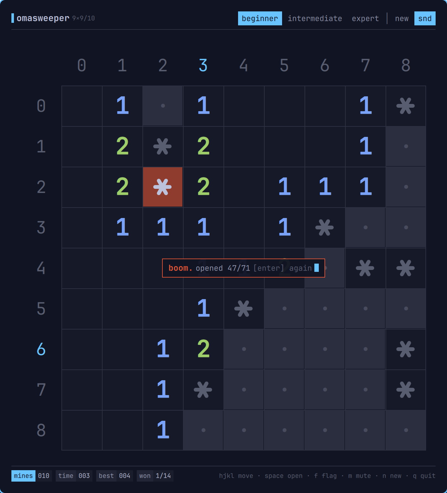
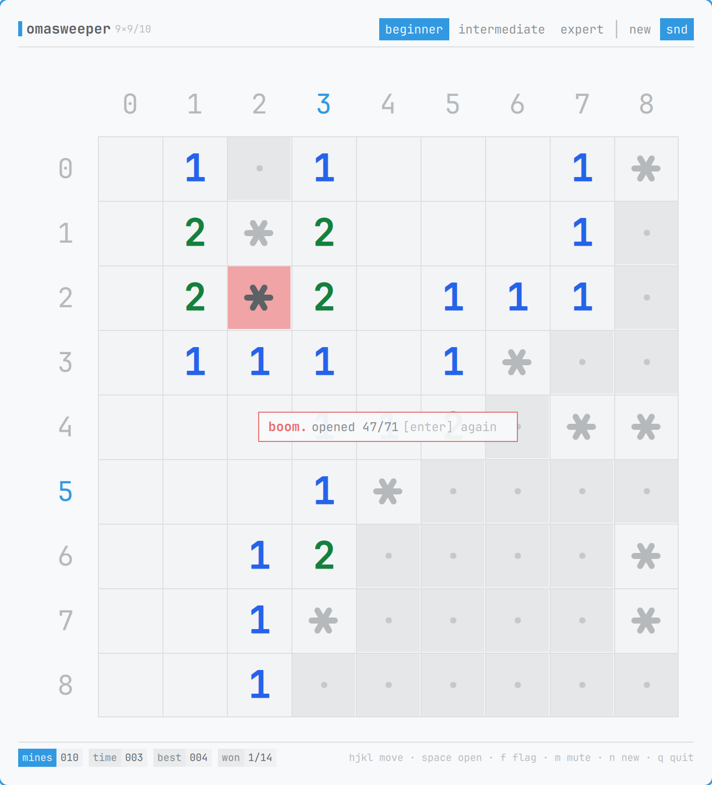
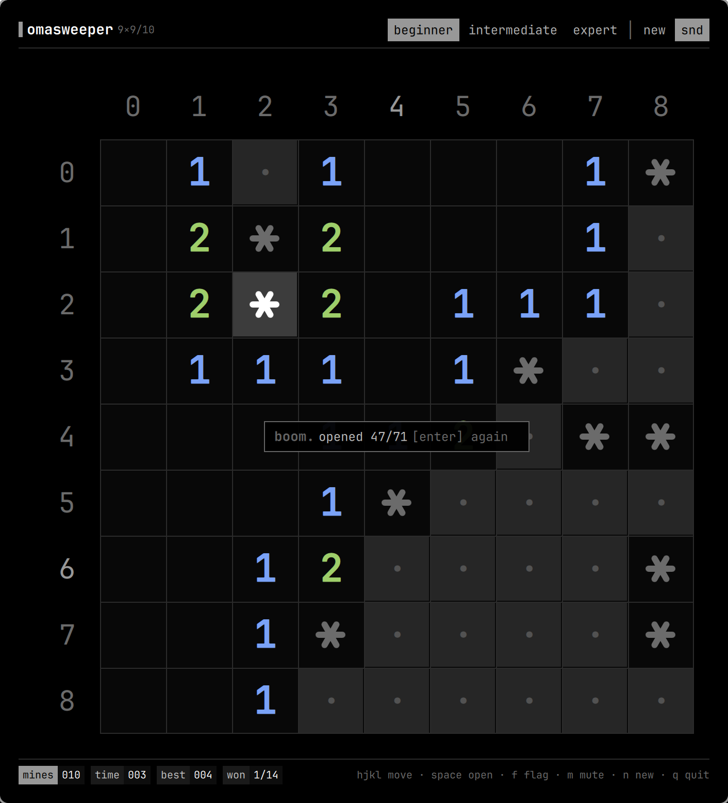

# Omasweeper

Minesweeper as an Omarchy shell plugin, drawn the way a terminal would draw
it: a character grid on hairlines, base-36 row and column labels down the
gutter, ANSI-coloured numbers, and a status bar along the bottom. It opens as
an ordinary window, so Hyprland tiles it with everything else.

Nothing is bundled but seven small square-wave sounds. The board, the mines
and the flags are all drawn from the active Omarchy theme, so the whole thing
recolours with the desktop.

The same lost board under three Omarchy themes, which is the whole point of
drawing it from the palette rather than pinning colours:

| | | |
| --- | --- | --- |
|  |  |  |

- Beginner, intermediate and expert, switchable mid-game
- The first click is always safe, and so is everything around it
- Left-click opens, right-click flags, and clicking a satisfied number clears
  around it
- **Fully keyboard accessible**, with vim's motions: every move the mouse can
  make, the keyboard can make too, and `?` lists the keys
- 8-bit sound on every move, mutable with `m`
- Best time and win record per difficulty
- The game in progress is saved, so it survives closing the window *and*
  restarting the shell
- Closing the board unloads it: nothing of it runs while you are not playing

## Install

```bash
omarchy plugin add https://github.com/jankeesvw/omasweeper --enable
```

Or with the installer, which does the same thing and adds a launcher entry:

```bash
./install.sh
```

Then search for **Omasweeper** in the launcher, or bind a key to:

```bash
omarchy-shell shell toggle jankeesvw.omasweeper
```

A shell plugin is not an application, so nothing gives it a launcher entry on
its own: `omarchy plugin add` registers code inside the shell process, and the
launcher only indexes `.desktop` files. `install.sh` writes one to
`~/.local/share/applications/omasweeper.desktop` whose `Exec` is the same
toggle a keybinding runs. Adding the plugin without the installer leaves it
out of the launcher, which is a one-file fix if you want it back.

`install.sh` takes one optional override: `OMASWEEPER_REPO` registers the
plugin from a fork instead.

There is no bar icon. Omasweeper is a panel-only plugin, so enabling it adds
one entry to `plugins[]` in `shell.json` and touches the bar layout not at
all; closing the board lets the shell unload it again.

Coming from 1.0, which did have a bar icon, leaves that icon's layout entry
behind, and the shell counts the plugin as placed for as long as it is there:
`omarchy plugin enable` sees nothing left to do and never writes the
`plugins[]` entry. `install.sh` clears it for you. Updating by hand, the fix
is a disable and an enable:

```bash
omarchy plugin disable jankeesvw.omasweeper
omarchy plugin enable jankeesvw.omasweeper
```

## Keyboard

The whole game is playable without touching the mouse, and the motions are
vim's. There is a cursor on the board the moment you press a direction key,
and it stays out of the way until you do. The first key you press only puts
the cursor in the middle of the board, since there is nothing to move relative
to before that.

Press `?` for the same list in the game.

| Key | What it does |
| --- | --- |
| `h` `j` `k` `l`, or the arrow keys | Move the cursor |
| `0` `^` | First cell of the row |
| `$` | Last cell of the row |
| `gg` / `G` | Top / bottom of the column |
| `H` `M` `L` | Top, middle, bottom row |
| `ctrl-d` / `ctrl-u` | Half a board down / up |
| `space` / `enter` | Open the cell, or clear around it if it is a satisfied number |
| `f` | Flag or unflag the cell |
| `n` | New board |
| `1` `2` `3` | Beginner, intermediate, expert |
| `m` | Mute or unmute |
| `?` | The key list |
| `q` / `esc` | Close the window |

The whole board is always on screen, so `H` and `L` land where `gg` and `G`
do. They are bound anyway: a hand that types `hjkl` reaches for them without
asking whether there is anything to scroll.

Motions clamp at the edges rather than wrapping, and `M` is the middle row
while `m` is mute, the same case distinction vim makes everywhere else.

After a game ends, `space` or `enter` deals the next one. While the key list
is up it is the only thing listening: `?`, `esc`, `q`, `space` or `enter` put
it away and nothing else does anything.

## Mouse

| Click | What it does |
| --- | --- |
| Left, on a covered cell | Open it |
| Left, on a number whose flags add up | Clear around it |
| Middle, on a number | The same, for anyone who prefers it explicit |
| Right | Flag or unflag |

Clearing around a number is the fast way to finish a board and the only way to
lose one you had solved: if a flag is in the wrong place, the cells it was
vouching for open anyway.

## Difficulties

| Level | Board | Mines |
| --- | --- | --- |
| Beginner | 9 × 9 | 10 |
| Intermediate | 16 × 16 | 40 |
| Expert | 30 × 16 | 99 |

The column and row labels are base 36 — `0`-`9` then `a`-`t` — so even an
expert board keeps one character per label.

## Sound

Seven sounds, all square waves at 22050Hz in 8-bit mono, generated by
[`tools/make-sounds.py`](tools/make-sounds.py) and committed to `sounds/` so
there is nothing to build. They play through `pw-play`, `paplay` or `aplay`,
whichever the machine has, chosen at play time by
[`bin/omasweeper-play`](bin/omasweeper-play). A machine with none of them
stays silent rather than erroring once per click.

Mute with `m` or the `snd` tab in the header; the setting is remembered.
Nothing plays while the window is closed.

## The window

It is a normal toplevel window, not a layer-shell panel: it takes its place in
the tiling layout, takes focus like any other window, and leaves the rest of
the desktop usable while it is open. The board takes its cell size from the
window, so a bigger window is a bigger board rather than a small board in a
large frame.

It reports class `org.quickshell` and title `omasweeper`, which is what a
Hyprland rule can key off:

```
windowrule = float, title:^(omasweeper)$
windowrule = size 780 640, title:^(omasweeper)$
```

## Removal

```bash
omarchy plugin remove jankeesvw.omasweeper
```

That unregisters the plugin and drops its entry from `shell.json`. The saved
game is left behind; delete it too with:

```bash
rm -rf ~/.local/state/omasweeper
```

## What it writes, and what it does not

- `~/.local/state/omasweeper/state.json` — the game in progress, the
  difficulty, the mute setting and the best times. Written after each move,
  debounced.

Nothing else on the system is touched. The plugin makes **no network
requests**, needs no credentials, runs nothing privileged, and starts no
process beyond a `mkdir -p` for its own state directory and the sound player
above.

## Playing it from a script

The plugin exposes a test channel, which is how the game was exercised without
a hand on the mouse. It lives in the board, so it only answers while the board
is open: closing it unloads the plugin, and the channel with it.

```bash
omarchy-shell shell summon jankeesvw.omasweeper   # the channel needs an open board
omarchy-shell jankeesvw.omasweeper.test deal
omarchy-shell jankeesvw.omasweeper.test play 4 4
omarchy-shell jankeesvw.omasweeper.test flag 2 4
omarchy-shell jankeesvw.omasweeper.test key "g g 0 space"
omarchy-shell jankeesvw.omasweeper.test board
omarchy-shell jankeesvw.omasweeper.test state
omarchy-shell jankeesvw.omasweeper.test cursor
omarchy-shell jankeesvw.omasweeper.test snap /tmp/board.png
```

`board` prints the board as text (`#` covered, `F` flag, `*` mine, `.` opened
and empty), `state` prints the counters as JSON, and `cursor` prints where the
keyboard cursor is and whether the key list is up. `state` leads with
`loaded`, which is false until the saved game has been read back off disk. The
keyboard and the pointer are dead until it turns true, since the restore
replaces every cell; the channel is not, so that a harness can test a loading
board, which means a script that deals should wait for it:

```bash
until omarchy-shell jankeesvw.omasweeper.test state | jq -e .loaded >/dev/null; do
  sleep 0.05
done
```

`key` types keys by name, one press per word: `h`, `G`, `$`, `C-d`, `space`,
`?`, and `gg` as `g g`, which is how you type it anyway. `snap` writes the
window to a PNG by re-rendering the scene rather than reading the screen, so
the board comes out even when it is on a workspace you are not looking at.

Every entry point goes through the same functions the pointer and the keyboard
call, so a scripted game and a played one cannot drift apart. There is also
`mines`, which spoils the board on purpose so a test can play a game out to a
win.

## Where things live

| Path | What |
| --- | --- |
| `manifest.json` | Plugin manifest: `panel`, nothing kept loaded |
| `Panel.qml` | The whole game: model, board, window, keys, sound |
| `sounds/` | The seven square waves |
| `tools/make-sounds.py` | Regenerates them |
| `bin/omasweeper-play` | Picks a player and plays one file |
| `icon.svg` | Launcher icon |
| `preview.png` | Marketplace preview |
| `~/.local/state/omasweeper/state.json` | Saved game, difficulty, mute, best times |

## Licence

MIT. Minesweeper itself is nobody's to own.
